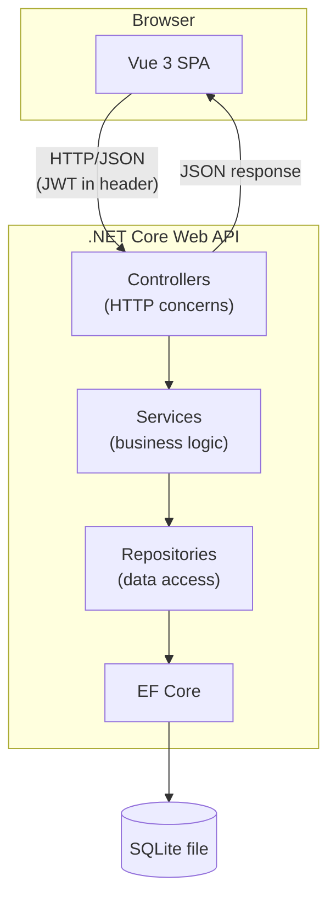
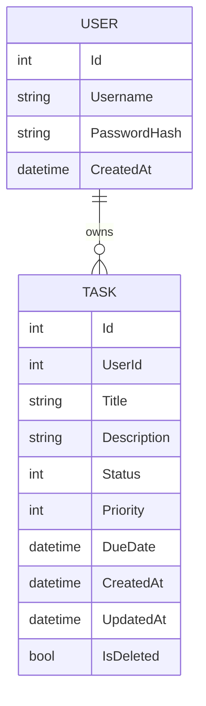

# To-Do Task Management App — Implementation Specification

## 1. Overview & Goals

### Purpose of this document
This is an implementation specification for a take-home coding exercise. It is written primarily **for an implementing coding agent** (e.g., Claude Code) to build the application end-to-end with minimal need for clarifying questions. All architecture, data model, and API decisions below are intentionally explicit and final for this version of the spec — ambiguities encountered during implementation should default to the choices documented here rather than agent judgment. Where a decision was deliberately deferred or simplified, that is called out explicitly in **Section 12 (Assumptions & Trade-offs)** and/or **Section 13 (Future Work)**, so a human reviewer can see that it was a conscious choice rather than an oversight.

Secondary audiences are the person commissioning this work (who may review or resume implementation across sessions) and, ultimately, the technical reviewers at the hiring company who will read the resulting code and README.

### What we're building
A small multi-user to-do task management application: users can register, log in, and manage their own list of tasks (create, read, update, delete, mark complete) via a Vue frontend communicating with a .NET Core Web API backend, persisted in SQLite via EF Core.

### Grading criteria (from the company's brief)
This spec is designed to produce a submission that demonstrates:
- Clean, well-structured code
- Thoughtful architectural decisions
- Good communication between frontend and backend
- Production-ready features and considerations
- Clear documentation and setup instructions

Every section of this spec exists in service of one or more of these criteria. Where a tension arises between them (e.g., "production-ready" vs. "simple enough to finish"), favor a small, well-justified, clearly-documented decision over a larger but unfinished or unexplained one.

### Definition of done
The exercise is complete when:
- A GitHub repo contains both frontend and backend projects, runnable via Docker Compose with a single command, per **Section 9**.
- The API contract in **Section 5** is fully implemented and matches the documented routes/payloads.
- The frontend (Section 7) supports the full task lifecycle and auth flow against the live backend.
- Unit and integration tests exist per **Section 10**.
- A README exists per **Section 11**, covering setup, assumptions, scalability notes, and future work.
- The Implementation Progress Checklist (**Section 14**) is fully checked off.

### Tech stack (previewed here, detailed in later sections)
- **Backend**: .NET Core Web API, Controller → Service → Repository layering, EF Core + SQLite
- **Frontend**: Vue 3, a `useTasks()` composable for state/data-fetching
- **Auth**: JWT-based registration/login, tasks scoped per user
- **Infra**: Docker Compose to run both projects locally with one command

### Guiding philosophy
Prefer simple, defensible decisions that are clearly explained over complex ones that are harder to justify in a short README. When in doubt, implement the smaller version of a feature correctly and document the larger version as future work, rather than implementing a partial/buggy version of the larger feature.

## 2. Scope & Out-of-Scope

### In-Scope (MVP)
- User registration & login (JWT-based)
- Per-user task isolation — each user sees and manages only their own tasks
- Task CRUD: create, read, update, delete
- Task status changes (e.g., marking complete / moving between statuses)
- Task fields: `Title`, `Description`, `Status`, `Priority`, `DueDate`, `CreatedAt`, `UpdatedAt` (full definitions in Section 4)
- Basic task list filtering by status, and sorting (e.g., by due date or priority)
- Basic input validation (required fields, max lengths, valid enum values)
- Standardized API error response shape
- Dockerized local run via `docker-compose up`
- Unit and integration tests for core logic (detailed in Section 10)
- README with setup steps, assumptions, scalability notes, and future work

### Out-of-Scope (explicitly deferred)

**Auth & Access Control**
- Password reset / "forgot password" flow
- Email verification
- Role-based access control (e.g., admin vs. regular user)

**Collaboration & Sharing**
- Task sharing, multi-user assignment, or any form of collaboration — tasks are strictly private to their owning user; there is no concept of shared lists, team workspaces, or assigning a task to another user

**Task Features**
- Subtasks / checklists within a task
- Tags / labels / categories
- File attachments on tasks
- Recurring tasks, reminders, or notifications
- Pagination on the task list (filtering and sorting are in scope; pagination is deferred)

**Operations & Infrastructure**
- Centralized logging / observability tooling (e.g., Serilog, Application Insights) — logging is discussed as a future consideration in the README, but not implemented
- Rate limiting / throttling
- Real production deployment (cloud hosting, CI/CD pipeline) — the deliverable runs locally via Docker
- Real-time updates (e.g., WebSockets/SignalR)

This boundary is intentional: everything in this list is a reasonable next step for a real product, but is left out here to keep the MVP small, correct, and clearly explainable within a take-home format. See **Section 13** for how these are framed as future work in the README.

## 3. Architecture Overview

### System diagram



The frontend and backend are separate projects (separate containers via Docker Compose — see Section 9), communicating exclusively over HTTP/JSON. There is no shared code or direct database access from the frontend.

### Backend layers

The backend follows a layered architecture: **Controller → Service → Repository**, with EF Core as the data access mechanism underneath the Repository layer.

- **Controllers** — Handle HTTP concerns only: routing, binding request DTOs, returning appropriate status codes and response DTOs. Contain no business logic. Apply `[Authorize]` where authentication is required and read the current user's ID from the validated JWT claims.
- **Services** — Contain business logic: validation orchestration, authorization checks (e.g., confirming a task belongs to the requesting user before allowing update/delete), and coordinating repository calls. This is where "is this allowed" and "does this make sense" questions are answered.
- **Repositories** — Data access only. Abstract EF Core behind an interface (e.g., `ITaskRepository`, `IUserRepository`) so services depend on an interface, not on `DbContext` directly. Returns/accepts domain entities, not DTOs.
- **Models/Entities** — EF Core entity classes representing database tables (`User`, `TaskItem`).
- **DTOs** — Request/response shapes used at the API boundary, distinct from entities, so internal model changes don't leak into the API contract and vice versa.

Dependency direction flows one way: Controllers depend on Service interfaces, Services depend on Repository interfaces. This makes each layer mockable in isolation for unit testing (see Section 10).

### Project structure approach

This is implemented as a **single ASP.NET Core Web API project** with folder-based separation (`Controllers/`, `Services/`, `Repositories/`, `Models/`, `DTOs/`), rather than a multi-project solution (e.g., separate `Api`/`Core`/`Infrastructure` class library projects). The layering is enforced by convention and interfaces rather than project/assembly boundaries. This is a deliberate scope-proportionate trade-off — see Section 12.

### Authentication placement in the architecture

JWT validation happens in ASP.NET Core's built-in authentication middleware, configured once at startup. Controllers declare `[Authorize]` on protected endpoints; the framework validates the token before the controller action runs. Controllers/services then read the authenticated user's ID from `HttpContext.User` claims — no controller or service ever handles raw tokens or validates them manually. This keeps auth concerns out of business logic entirely.

### Frontend architecture (preview)

The Vue 3 SPA is a single-page application using Vue Router to switch between auth views (login/register) and the main task views. Data fetching and state for tasks live in a `useTasks()` composable, which wraps `fetch` calls to the API and exposes reactive state to components. Full component breakdown is in Section 7.

### Cross-origin requests

Since the frontend and backend run as separate containers/processes on different ports, the backend must configure a CORS policy permitting requests from the frontend's origin. To remove any ambiguity for the agent, the local ports are fixed (and match the Docker port mapping in Section 9):

- Frontend: `http://localhost:5173`
- Backend: `http://localhost:5000`

The .NET CORS middleware must explicitly allow `http://localhost:5173` as the permitted origin — not a wildcard (`*`) — since the API requires credentials (the `Authorization` header) on every protected request, and wildcard origins cannot be combined with credentialed requests under the CORS spec.

### Other architectural notes
- All communication is synchronous request/response (HTTP). No background jobs, queues, or async messaging in this MVP.
- No server-side rendering — the API is a pure JSON API; the frontend is a fully client-rendered SPA.

## 4. Data Model

### Entity-relationship diagram



A `User` has many `Task` records (1:N) via the `UserId` foreign key on `Task`. There is no other relationship in the schema for this MVP (no shared tasks, no tags, no subtasks — per Section 2).

### `User` entity

| Field | Type | Constraints | Notes |
|---|---|---|---|
| `Id` | `int` | PK, identity | |
| `Username` | `string` | Required, unique, non-empty, max length 50 | Login identifier. Uniqueness enforced via a unique index. |
| `PasswordHash` | `string` | Required | Stores a hashed password (see Section 6) — the plaintext password is never persisted. |
| `CreatedAt` | `datetime` (UTC) | Required, set once on insert | |

Field length limits (e.g., `Username` max 50) are reasonable defaults chosen for this spec, not requirements handed down from elsewhere — see Section 12.

### `Task` entity

| Field | Type | Constraints | Notes |
|---|---|---|---|
| `Id` | `int` | PK, identity | |
| `UserId` | `int` | Required, FK → `User.Id` | Scopes the task to its owning user. Indexed for query performance. |
| `Title` | `string` | Required, non-empty, max length 200 | |
| `Description` | `string` | Optional, max length 2000 | |
| `Status` | `enum` (int-backed) | Required, default `Todo` | See enum definition below. |
| `Priority` | `enum` (int-backed) | Required, default `Medium` | See enum definition below. |
| `DueDate` | `datetime` (UTC) | Optional | |
| `CreatedAt` | `datetime` (UTC) | Required, set once on insert | |
| `UpdatedAt` | `datetime` (UTC) | Required, updated on every modification | |
| `IsDeleted` | `bool` | Required, default `false` | Soft-delete flag — see below. |

### Enums

These exact names and integer values are used consistently across the database, backend code, and the API contract (Section 5) — the agent should not introduce alternate naming.

```
enum TaskStatus {
    Todo = 0,
    InProgress = 1,
    Done = 2
}

enum TaskPriority {
    Low = 0,
    Medium = 1,
    High = 2
}
```

Enums are stored as their underlying `int` value in SQLite (EF Core default behavior), and serialized as strings (e.g., `"InProgress"`) in API request/response JSON for readability — see Section 5 for exact JSON shapes. The mapping between the int-backed DB value and the string-based JSON representation is handled at the API/DTO boundary, not in the database.

### Soft delete

Deleting a task sets `IsDeleted = true` rather than removing the row. All read queries (list, get-by-id) filter out rows where `IsDeleted = true` by default. This is a deliberate "production-ready" signal — it preserves data and leaves room for a future "trash/restore" feature or audit trail — at the minor cost of every query needing the filter. This trade-off is discussed further in Section 12.

### Indexes
- Unique index on `User.Username`
- Index on `Task.UserId` (supports the common "get all tasks for this user" query)

### What's deliberately not modeled here
Tags, subtasks, attachments, and any cross-user relationships are intentionally absent from this schema, consistent with Section 2's scope boundary.

EF Core configuration (Fluent API vs. annotations, `DbContext` setup, migrations strategy) is covered in **Section 8**.

## 5. API Contract

This section defines the complete API surface: every route, method, request/response body, and status code. The implementing agent should treat these shapes as final — not as a starting point to be redesigned.

### Conventions
- All request/response bodies are JSON.
- All authenticated endpoints require an `Authorization: Bearer <token>` header.
- Enum fields (`Status`, `Priority`) are serialized as **strings** in JSON (e.g., `"InProgress"`), even though they're stored as ints in the database (see Section 4).
- All datetimes are ISO 8601 strings in UTC (e.g., `"2026-06-26T14:30:00Z"`).
- The standardized error response shape (used by all endpoints) is defined at the end of this section, after both auth and task endpoints.

### Auth Endpoints

#### `POST /api/auth/register`
Creates a new user and immediately logs them in (returns a token), since this is an MVP with no email verification step.

**Request body:**
```json
{
  "username": "jane_doe",
  "password": "string (min length enforced server-side)"
}
```

**Success response — `201 Created`:**
```json
{
  "token": "eyJhbGciOi...",
  "user": {
    "id": 1,
    "username": "jane_doe"
  }
}
```

**Error responses:**
- `400 Bad Request` — validation failure (e.g., empty username, password too short)
- `409 Conflict` — username already taken

#### `POST /api/auth/login`
**Request body:**
```json
{
  "username": "jane_doe",
  "password": "string"
}
```

**Success response — `200 OK`:**
```json
{
  "token": "eyJhbGciOi...",
  "user": {
    "id": 1,
    "username": "jane_doe"
  }
}
```

**Error responses:**
- `400 Bad Request` — missing username/password
- `401 Unauthorized` — invalid username or password (the response does not indicate which one, to avoid leaking which usernames exist)

#### `GET /api/auth/me`
Returns the current authenticated user, derived from the JWT. Used by the frontend on app load to restore session state without re-prompting login.

**Headers:** `Authorization: Bearer <token>`

**Success response — `200 OK`:**
```json
{
  "id": 1,
  "username": "jane_doe"
}
```

**Error responses:**
- `401 Unauthorized` — missing, invalid, or expired token

#### Notes on auth
- The JWT contains the user's `id` and `username` as claims, plus a 1-hour expiration (`exp`).
- There is no logout endpoint. Because JWTs are stateless, "logout" is a frontend-only action (discard the stored token). The server does not track or invalidate sessions.
- There is no refresh token mechanism in this MVP — when a token expires, the user must log in again. This is a deliberate scope trade-off (see Section 12).
- Password rules are minimum-length only (no complexity requirements) — also a documented MVP trade-off (see Section 12).

### Task Endpoints

All task endpoints require `Authorization: Bearer <token>` and operate only on the authenticated user's own tasks. A task that exists but belongs to a different user is treated identically to a task that doesn't exist (`404 Not Found`) — the API never reveals the existence of another user's data.

#### `GET /api/tasks`
Lists the current user's non-deleted tasks, with optional filtering and sorting via query parameters.

**Query parameters (all optional):**
| Param | Allowed values | Default |
|---|---|---|
| `status` | `Todo`, `InProgress`, `Done` | none (no filter — all statuses returned) |
| `sortBy` | `dueDate`, `priority`, `createdAt` | `createdAt` |
| `sortOrder` | `asc`, `desc` | `desc` |

Example: `GET /api/tasks?status=InProgress&sortBy=dueDate&sortOrder=asc`

**Success response — `200 OK`:**
```json
{
  "tasks": [
    {
      "id": 1,
      "title": "Buy groceries",
      "description": "Milk, eggs, bread",
      "status": "Todo",
      "priority": "Medium",
      "dueDate": "2026-07-01T00:00:00Z",
      "createdAt": "2026-06-26T10:00:00Z",
      "updatedAt": "2026-06-26T10:00:00Z"
    }
  ]
}
```
Note: `userId` is intentionally omitted from the response — it's implicit, since the API only ever returns the current user's own tasks. The wrapping object (`{ "tasks": [...] }`) leaves room to add pagination metadata (e.g., `totalCount`) later without a breaking change, even though pagination itself is out of scope for MVP.

**Error responses:**
- `400 Bad Request` — invalid `status`, `sortBy`, or `sortOrder` value
- `401 Unauthorized` — missing/invalid token

#### `GET /api/tasks/{id}`
**Success response — `200 OK`:** same single-task shape as above.

**Error responses:**
- `401 Unauthorized` — missing/invalid token
- `404 Not Found` — task doesn't exist, is soft-deleted, or belongs to another user

#### `POST /api/tasks`
**Request body:**
```json
{
  "title": "Buy groceries",
  "description": "Milk, eggs, bread",
  "status": "Todo",
  "priority": "Medium",
  "dueDate": "2026-07-01T00:00:00Z"
}
```
- `title` — required, non-empty, max 200 chars
- `description` — optional, max 2000 chars
- `status` — optional, defaults to `Todo` if omitted
- `priority` — optional, defaults to `Medium` if omitted
- `dueDate` — optional

**Success response — `201 Created`:** the created task, in the same shape as the list items, including server-generated `id`, `createdAt`, `updatedAt`.

**Error responses:**
- `400 Bad Request` — validation failure (e.g., missing title, title too long, invalid enum value)
- `401 Unauthorized` — missing/invalid token

#### `PUT /api/tasks/{id}`
Full replace — the client sends the complete task object, including any status change. There is no separate endpoint for toggling status; marking a task "done" is just an update with `status: "Done"`. This is an intentional MVP simplification — a dedicated `PATCH /api/tasks/{id}/status` endpoint would be a nice future touch for a cleaner "checkbox toggle" interaction, but is not implemented now (see Section 12).

**Request body:** same shape as `POST`, all fields required (full replace semantics):
```json
{
  "title": "Buy groceries",
  "description": "Milk, eggs, bread, cheese",
  "status": "Done",
  "priority": "Medium",
  "dueDate": "2026-07-01T00:00:00Z"
}
```

**Success response — `200 OK`:** the updated task (with `updatedAt` refreshed).

**Error responses:**
- `400 Bad Request` — validation failure
- `401 Unauthorized` — missing/invalid token
- `404 Not Found` — task doesn't exist, is soft-deleted, or belongs to another user

#### `DELETE /api/tasks/{id}`
Performs a soft delete (`IsDeleted = true`). The task no longer appears in `GET /api/tasks` or is retrievable via `GET /api/tasks/{id}`.

**Success response — `204 No Content`**

### Standardized Error Response Shape

All error responses across every endpoint use this shape:

```json
{
  "error": {
    "code": "VALIDATION_ERROR",
    "message": "One or more fields are invalid.",
    "details": [
      { "field": "title", "message": "Title is required." }
    ],
    "traceId": "0HN7K2OEJ8L9F:00000001",
    "correlationId": "a1b2c3d4-e5f6-7890-abcd-1234567890ef"
  }
}
```

- **`code`** — a machine-readable string identifying the error type (e.g., `VALIDATION_ERROR`, `NOT_FOUND`, `UNAUTHORIZED`, `DUPLICATE_USERNAME`). The frontend can branch on this without parsing message text.
- **`message`** — a human-readable summary, safe to display to the user.
- **`details`** — an array of field-level errors, populated only for `VALIDATION_ERROR` responses; omitted (or empty) for other error types.
- **`traceId`** — ASP.NET Core's built-in per-request trace identifier (`HttpContext.TraceIdentifier`). Requires no extra plumbing to generate, and gives a concrete hook for future logging/observability (Section 13) — a developer could grep logs for this ID once real logging exists.
- **`correlationId`** — a UUID that, if the caller supplies an `X-Correlation-Id` request header, is echoed back; otherwise the server generates one. This supports tracing a single logical request across frontend and backend boundaries (and across future service boundaries) even before a real logging/observability pipeline exists.

Common `code` values used across endpoints:

| Code | HTTP Status | Used by |
|---|---|---|
| `VALIDATION_ERROR` | 400 | Any endpoint with invalid input |
| `UNAUTHORIZED` | 401 | Missing/invalid/expired token, bad login credentials |
| `NOT_FOUND` | 404 | Task doesn't exist / not owned by caller |
| `DUPLICATE_USERNAME` | 409 | Register with a taken username |

### Where this is implemented
All error responses are produced by a single global exception-handling middleware component, rather than per-controller try/catch blocks. This keeps error formatting consistent and DRY, and is the natural place to later plug in real logging (Section 13). Implementation details are in **Section 8**.

## 6. Authentication & Authorization

This section covers the mechanics and policy behind the auth endpoints already contracted in Section 5, and the architectural placement already noted in Section 3. It is the canonical reference for *how* auth is implemented, not a restatement of the request/response shapes.

### Password hashing
Passwords are hashed using ASP.NET Core's built-in `PasswordHasher<T>` (PBKDF2-based, well-vetted, no extra NuGet dependency required). Plaintext passwords are never persisted or logged. This is a deliberately simple, defensible choice over pulling in an external library (e.g., BCrypt) — see Section 12.

### JWT signing and validation
- **Algorithm**: HMAC-SHA256 (symmetric signing) — appropriate for a single self-contained API where only this service issues and validates tokens. Asymmetric signing (RSA) would only matter if multiple independent services needed to verify tokens without sharing a secret, which doesn't apply here.
- **Signing key source**: a secret string read from configuration/environment variable (e.g., `Jwt__Secret`), never hardcoded in source. For local/Docker use, this is supplied via an environment variable (see Section 9). A real production deployment would source this from a managed secrets store (e.g., Azure Key Vault, AWS Secrets Manager) instead — noted as future work in Section 13.
- **Claims included**: `sub` (user ID), a `username` claim, `iat`, and `exp` (1 hour from issuance, per Section 5).
- **Issuer/Audience validation**: the token's `Issuer` and `Audience` are set to fixed configured values and validated on every request (`ValidateIssuer = true`, `ValidateAudience = true`), in addition to signature and expiration validation. This costs nothing extra to implement and is a small additional layer of correctness.
- **Where validation happens**: ASP.NET Core's authentication middleware, configured once at startup (per Section 3). Controllers never manually parse or validate tokens — they declare `[Authorize]` and read claims from `HttpContext.User` after the middleware has already validated the token.

### Authorization (ownership enforcement)
Authentication confirms *who* the caller is; authorization confirms *what they're allowed to touch*. For this app, the only authorization rule is: **a user may only read, update, or delete their own tasks.**

This check lives in the **Service layer**, not the controller and not the repository:
- The controller extracts the current user's ID from `HttpContext.User` claims and passes it into the service method alongside the request.
- The service loads the task (via the repository) and compares `task.UserId` against the current user's ID. If they don't match — or the task doesn't exist — the service throws a `NotFoundException`, which the global error-handling middleware (Section 5/8) maps to `404 Not Found`.
- The repository itself is not responsible for authorization; it only knows how to fetch/persist entities.

This placement means the ownership rule is enforced in exactly one place, is unit-testable in isolation (Section 10), and can't be accidentally bypassed by adding a new controller action that forgets the check.

### Hard rule: never trust a client-supplied user ID
No request body or query parameter ever contains a `userId` field that the backend trusts for identifying *whose* data to act on (note: this is distinct from `Task.UserId`, the internal foreign key). The current user's ID is **always** derived from the validated JWT on the server side. This prevents a client from passing another user's ID and accessing their data. The API contract in Section 5 reflects this — no task request body includes a `userId` field.

### What this auth system intentionally does not include
No password reset, email verification, roles/permissions, or refresh tokens — see Section 2 for the full scope boundary. These are documented as future work in Section 13.

## 7. Frontend Design

### Language & tooling
- **Language**: TypeScript (not plain JavaScript). Given the backend is strongly typed (.NET/C#), a typed frontend keeps the contract between the two layers more reliable — e.g., the API response shapes in Section 5 can be defined as TypeScript interfaces/types and reused across the composables and components below.
- **Build tool**: Vite (`npm create vite@latest -- --template vue-ts`), consistent with the Docker build approach already specified in Section 9.
- **Package manager**: `npm`. A single package manager is specified explicitly so the agent generates one consistent lockfile (`package-lock.json`) rather than mixing tools.

### Routes
| Path | View | Access |
|---|---|---|
| `/login` | `LoginView` | Public only — authenticated users are redirected to `/` |
| `/register` | `RegisterView` | Public only — authenticated users are redirected to `/` |
| `/` | `TaskListView` | Protected — unauthenticated users are redirected to `/login` |

Navigation guards (via Vue Router) enforce both directions of this redirect, checking `useAuth().isAuthenticated`.

### Component tree

```
App
├── LoginView
├── RegisterView
└── TaskListView                  (protected route)
    ├── AppHeader                 (shows current username, logout button)
    ├── TaskFilters                (status filter dropdown, sort controls)
    ├── TaskList
    │   └── TaskItem               (one per task; shows fields, edit/delete/status actions)
    └── TaskFormModal              (shared for both create and edit; opened from TaskListView)
```

Create and edit both use the same `TaskFormModal`, opened either empty (create) or pre-filled with an existing task's data (edit), rather than separate pages/routes — this keeps the interaction fast for a small CRUD app. This component breakdown is a starting proposal; the agent may adjust component boundaries slightly if a cleaner split emerges during implementation, but should stay within this overall shape.

### `useAuth()` composable

Encapsulates authentication state and actions:

```js
const {
  user,              // { id, username } | null
  token,             // string | null
  isAuthenticated,   // computed boolean
  login,             // (username, password) => Promise<void>
  register,          // (username, password) => Promise<void>
  logout,            // () => void
  restoreSession,    // () => Promise<void>
} = useAuth()
```

- `login`/`register` call the corresponding API endpoints (Section 5), store the returned token in `localStorage`, and populate `user`/`token` state.
- `logout` clears `localStorage` and resets `user`/`token` to `null`. No API call is made (per Section 6 — JWTs are stateless, logout is frontend-only).
- `restoreSession` runs once on app load: if a token exists in `localStorage`, it calls `GET /api/auth/me` to validate the token and repopulate `user` state; if the call fails (expired/invalid token), it clears the stored token and leaves the user logged out.

### `useTasks()` composable

Encapsulates task data and actions:

```js
const {
  tasks,             // ref<Task[]>
  isLoading,         // ref<boolean>
  error,             // ref<string | null>
  fetchTasks,        // (filters?: { status?, sortBy?, sortOrder? }) => Promise<void>
  createTask,        // (data) => Promise<void>
  updateTask,        // (id, data) => Promise<void>
  deleteTask,        // (id) => Promise<void>
} = useTasks()
```

Each action calls the corresponding API endpoint (Section 5), updates `isLoading`/`error` appropriately, and refreshes `tasks` on success.

### API communication
A small shared fetch wrapper (e.g., `apiClient.js`) centralizes: base URL configuration, attaching the `Authorization: Bearer <token>` header (reading from `useAuth()`/localStorage), and parsing the standardized error shape (Section 5) into a consistent JS error object. Both composables use this wrapper rather than calling `fetch` directly, so header/error-handling logic isn't duplicated.

### UI states
For the task list and forms, the following states are required (cheap to implement, expected for "production-ready" framing):
- **Loading** — a simple spinner/skeleton while `isLoading` is true
- **Empty** — a friendly message when the (possibly filtered) task list is empty, distinct from the loading state
- **Error** — an inline error banner/message when a request fails, using the message from the standardized error response

### Form validation
The frontend mirrors minimal backend validation (e.g., title required, max lengths) for fast user feedback, but the backend remains the source of truth — the frontend should not attempt to replicate every validation rule independently; it primarily surfaces errors returned by the API.

### Styling
No specific design system or CSS framework is required. Basic, clean styling is sufficient — visual polish is not a grading priority for this exercise (per Section 1).

### Token storage
The JWT is stored in `localStorage`. This is the simplest common approach for a SPA and is consistent with the Bearer-token design in Section 5/6. The known XSS-exposure trade-off of `localStorage` (vs. an httpOnly cookie) is acknowledged in Section 12 rather than addressed here.

## 8. Backend Implementation Details

### Target framework
.NET 9, ASP.NET Core Web API.

### Project folder structure

A single Web API project (per Section 3's decision), organized by folder:

```
TodoApp.Api/
├── Controllers/        (AuthController, TasksController)
├── Services/           (IAuthService/AuthService, ITaskService/TaskService)
├── Repositories/       (IUserRepository/UserRepository, ITaskRepository/TaskRepository)
├── Models/             (User, TaskItem entity classes; TaskStatus/TaskPriority enums)
├── DTOs/               (RegisterRequest, LoginRequest, TaskRequest, TaskResponse, AuthResponse, ErrorResponse, etc.)
├── Data/
│   ├── AppDbContext.cs
│   └── Configurations/  (UserConfiguration, TaskConfiguration — IEntityTypeConfiguration<T> classes)
├── Exceptions/          (NotFoundException, ValidationException, ConflictException)
├── Migrations/          (EF Core generated migrations — committed to the repo)
└── Program.cs
```

### EF Core configuration
Entity configuration uses the **Fluent API**, via one `IEntityTypeConfiguration<T>` class per entity (`UserConfiguration`, `TaskConfiguration`) rather than Data Annotations on the entity classes themselves. This keeps entity classes free of EF-specific attributes and keeps all schema concerns (constraints, indexes, relationships) in one discoverable place per entity. These are applied in `AppDbContext.OnModelCreating` via `modelBuilder.ApplyConfigurationsFromAssembly(...)`.

Note: this is a different concern from **DTO input validation** (next section), which does use Data Annotations — Fluent API governs the database schema, Data Annotations govern API request validation.

### Migrations
Real EF Core Code-First migrations are used — not `EnsureCreated()`. The initial migration is generated and **committed to the repository**, and migrations are applied automatically on startup via `db.Database.Migrate()` in `Program.cs`. This means running the app (locally or via Docker) always results in an up-to-date schema with no manual migration step required, while still demonstrating the realistic migration-history pattern a production app would use.

### Request validation
Request DTOs use **Data Annotations** (`[Required]`, `[MaxLength]`, etc.) combined with ASP.NET Core's built-in automatic model validation. When model validation fails, it's translated into the standardized `VALIDATION_ERROR` response shape (Section 5) with field-level `details`, via the global exception/validation handling described below — not via repeated manual `if (!ModelState.IsValid)` checks in every controller action.

### Custom exceptions and error mapping
Business-rule errors are represented as small custom exception types, thrown from the Service layer and translated into HTTP responses in one place:

| Exception | HTTP Status | `code` |
|---|---|---|
| `ValidationException` | 400 | `VALIDATION_ERROR` |
| `UnauthorizedException` | 401 | `UNAUTHORIZED` |
| `NotFoundException` | 404 | `NOT_FOUND` |
| `ConflictException` | 409 | `DUPLICATE_USERNAME` (or other conflict-specific code) |
| (unhandled exception) | 500 | `INTERNAL_ERROR` |

### Global error handling
Implemented using ASP.NET Core's `IExceptionHandler` (the modern .NET 8+ pattern), registered once in `Program.cs`. This single handler catches the custom exceptions above (and any unhandled exception, mapped to a generic 500) and produces the standardized error response shape from Section 5, including `traceId` (from `HttpContext.TraceIdentifier`) and `correlationId` (echoed from the `X-Correlation-Id` header or generated). No controller contains its own try/catch for these cases.

### Demo data seeding (important — do not use `HasData`)
The demo user and sample tasks (Section 11) must be seeded by running real application logic in `Program.cs` at startup, **after** the DI container is built and **after** migrations are applied — not via EF Core's `HasData()` in `OnModelCreating`.

This distinction matters because the demo user's password must be hashed using `PasswordHasher<T>` (Section 6), which is a service resolved from DI. `HasData()` runs as part of model configuration/migration generation, long before any DI container exists, so it cannot call injected services — attempting to hash a password there either fails or forces an awkward workaround (e.g., a precomputed hash baked into a migration). Instead:

1. After `app.Build()` and after `db.Database.Migrate()` runs, create a DI scope.
2. Resolve `AppDbContext` and `PasswordHasher<T>` (or `IAuthService`, if seeding is implemented as a service call) from that scope.
3. If no users exist, create the demo user (hashing its password normally, via the same code path real registration uses) and a few sample tasks, then save.

This keeps seeding consistent with how a real user would be created — through the same hashing logic — rather than introducing a second, divergent path for password storage.

### Dependency injection
Services and repositories are registered against their interfaces with **Scoped** lifetime (one instance per request) in `Program.cs` — the standard ASP.NET Core convention for stateless-per-request dependencies like these.

### API documentation (Swagger/OpenAPI)
`Swashbuckle.AspNetCore` is added to generate Swagger/OpenAPI documentation, exposed at `/swagger` when the app is running. This is a low-cost addition (a few lines in `Program.cs`) that gives reviewers a live, interactive view of the API contract (Section 5) without needing a separate tool — a small but real "good documentation" signal. The JWT Bearer scheme is configured in the Swagger setup so `/swagger` supports authorizing requests with a token (via an "Authorize" button), making it possible to exercise protected endpoints directly from the Swagger UI.

### `Program.cs` responsibilities
Kept as wire-up only, no business logic:
1. Register DI services (repositories, services — Scoped)
2. Configure `AppDbContext` with the SQLite connection string (from configuration)
3. Configure JWT authentication (Section 6) and authorization
4. Configure the CORS policy (Section 3) to allow the frontend's origin
5. Register the global exception handler (`IExceptionHandler`)
6. Register Swagger/OpenAPI generation (`Swashbuckle.AspNetCore`), including JWT Bearer support in the Swagger UI
7. Apply pending EF Core migrations on startup (`db.Database.Migrate()`)
8. Seed a demo user (and a few sample tasks) on startup if none exists, via a DI scope resolved **after** migration — never via `HasData()` (see "Demo data seeding" above; full content requirements in Section 11)
9. Map controllers, run the app

## 9. Docker & Local Setup

### Goal
A reviewer clones the repo and runs a single command — `docker-compose up --build` — and both the frontend and backend are reachable with no other setup steps (no manual env file creation, no manual migration step, no separately installing Node/.NET locally).

### Container layout
Two services, orchestrated via a single `docker-compose.yml` at the repo root:

- **`backend`** — ASP.NET Core Web API, built via a multi-stage `Dockerfile` (SDK image to build/publish, ASP.NET runtime image to run).
- **`frontend`** — Vue app, built via a multi-stage `Dockerfile`: a Node image runs `npm install && npm run build` to produce static files, then an `nginx` image serves those static files. This is the production-like serving approach (vs. running the Vite dev server inside the container), consistent with the "production-ready" framing.

### Ports (defaults — adjustable, but should be documented in the README)
| Service | Container port | Host port |
|---|---|---|
| `backend` | 8080 | 5000 |
| `frontend` (nginx) | 80 | 5173 |

### Nginx SPA routing (important — common failure point)
The default nginx configuration serves files by exact path and returns a 404 for any path that doesn't match a physical file. This breaks client-side routing: since `/` is the only route this app uses for the protected view (Section 7), a reviewer who navigates to `/` and then refreshes the page would otherwise see an nginx 404 instead of the Vue app.

The frontend's nginx config must include a fallback to `index.html` for unmatched paths:
```nginx
location / {
    try_files $uri $uri/ /index.html;
}
```
This ensures any client-side route is served the SPA shell, and Vue Router then resolves the route on the client. This is a one-line fix but a common, easy-to-miss mistake when Dockerizing a Vue/React app with nginx — explicitly called out here so it isn't skipped.

### SQLite persistence
The SQLite database file is written to a path inside the backend container that is mapped to a **named Docker volume**, so data survives container restarts/rebuilds (`docker-compose down` followed by `up` retains data; only an explicit `docker-compose down -v` clears it).

### Environment variables
Set with default values directly in `docker-compose.yml`, so the app runs with zero required setup. A comment in the compose file notes that in a real production deployment, secrets (especially `Jwt__Secret`) would come from a managed secrets store rather than being committed in plain text — this ties back to Section 6.

| Variable | Purpose | Where used |
|---|---|---|
| `Jwt__Secret` | HMAC signing key for JWTs | backend |
| `Jwt__Issuer` | JWT issuer claim, validated | backend |
| `Jwt__Audience` | JWT audience claim, validated | backend |
| `ConnectionStrings__Default` | SQLite file path | backend |
| `VITE_API_BASE_URL` | Backend's base URL, baked in at frontend **build time** | frontend |

Note on the frontend env var: Vite environment variables are resolved at **build time**, not runtime — unlike a Node server, the static files produced by `npm run build` can't read environment variables at container startup. This means `VITE_API_BASE_URL` must be passed as a Docker build argument to the frontend's `Dockerfile`, not just as a runtime environment variable on the `frontend` service. This is called out explicitly here since it's a common point of confusion when Dockerizing a Vite app.

### Healthcheck
The `backend` service defines a Docker healthcheck (a simple HTTP GET to a lightweight endpoint, e.g., `/health`, returning `200 OK` once the app — including migrations — has started successfully). The `frontend` service's `depends_on` declares a `condition: service_healthy` on `backend`, so Compose waits for the backend to be ready before considering the stack fully up. This is a small but real "production-minded" touch and also avoids a race condition where the frontend serves before the backend has finished migrating.

### `.env.example`
A `.env.example` file is committed to the repo root, documenting the variables above (even though working defaults are already baked into `docker-compose.yml` for ease of review). The actual `.env` file (if a reviewer chooses to override defaults) is gitignored. This is standard practice and costs nothing to include.

### What running `docker-compose up --build` does, end to end
1. Builds the backend image (restores, builds, publishes the .NET app).
2. Builds the frontend image (installs npm deps, runs `npm run build`, copies output into an nginx image).
3. Starts `backend`: applies EF Core migrations automatically (Section 8), starts listening, healthcheck begins passing once ready.
4. Starts `frontend` once `backend` is healthy: nginx serves the built Vue app.
5. Reviewer opens `http://localhost:5173` in a browser and uses the app immediately — no manual database setup, no manual `dotnet ef database update`, no separate `npm install` on the host machine.

## 10. Testing Strategy

### Tooling
**xUnit**, using built-in `Assert` only — no additional mocking or assertion libraries (e.g., Moq, FluentAssertions). Interfaces for repositories/services (Section 3, 8) are already designed to be mockable; for this scope, hand-written fake/stub implementations of repository interfaces are sufficient for unit tests and keep the dependency footprint minimal. This is a deliberate simplicity choice for a take-home — see Section 12.

### Test project structure
Two test projects, separating concerns:
```
TodoApp.Api.UnitTests/          (Service layer logic, isolated via fakes/stubs)
TodoApp.Api.IntegrationTests/   (Full HTTP stack via WebApplicationFactory<Program>)
```

### Unit tests — focus: Service layer
The bulk of test coverage targets `AuthService` and `TaskService`, since that's where business logic and authorization decisions live (Section 6). Controllers are thin pass-throughs and repositories are thin EF Core wrappers — both are exercised indirectly via integration tests rather than given heavy dedicated unit test coverage.

**Concrete test cases — `AuthService`:**
- Register succeeds with valid username/password, returns a token
- Register fails with a conflict when the username is already taken
- Register fails validation when password is below minimum length
- Login succeeds with correct credentials, returns a token
- Login fails with `UnauthorizedException` for a wrong password
- Login fails with `UnauthorizedException` for a non-existent username

**Concrete test cases — `TaskService`:**
- Create task succeeds with valid input, defaults `Status`/`Priority` when omitted
- Create task fails validation when `Title` is empty or too long
- Get task succeeds when the task belongs to the requesting user
- Get task throws `NotFoundException` when the task belongs to a different user
- Get task throws `NotFoundException` when the task is soft-deleted
- Update task succeeds and updates `UpdatedAt`
- Update task throws `NotFoundException` for a non-owned task (same rule as get)
- Delete task soft-deletes (sets `IsDeleted = true`) rather than removing the row
- List tasks filters correctly by `status` when provided
- List tasks sorts correctly by the requested `sortBy`/`sortOrder`, and defaults to `createdAt desc` when omitted

### Integration tests — full HTTP stack
Using `WebApplicationFactory<Program>` to host the real app in-memory and issue real HTTP requests against a temporary SQLite database, isolated from the app's real database.

**Important implementation note**: SQLite's in-memory mode drops its schema and data the instant the underlying connection closes — and EF Core may open/close connections per operation by default. Use one of these two approaches, not a naive in-memory connection string:
- **Option A (recommended)**: use a real temporary file-based SQLite database (e.g., a uniquely named `.db` file per test run, written to a temp directory), deleted during test teardown. This behaves like a normal SQLite database and avoids any connection-lifetime subtlety.
- **Option B**: use an in-memory SQLite connection, but explicitly open and hold that single `SqliteConnection` open for the entire lifetime of the `WebApplicationFactory` (overriding DI registration so the same open connection is reused), rather than letting EF Core open/close it per-operation.

Option A is simpler to reason about and is the default recommendation; Option B is acceptable if the agent prefers to avoid filesystem cleanup, as long as the connection-lifetime requirement above is respected.

**Concrete test cases:**
- Full lifecycle happy path: register → login → create task → list tasks (appears) → update task → get task (reflects update) → delete task → list tasks (no longer appears)
- Requesting any task endpoint without an `Authorization` header returns `401`
- Requesting another user's task (by ID) returns `404`, not `403` or `200` (per Section 6)
- Registering with a duplicate username returns `409` with the standardized error shape
- Creating a task with an empty title returns `400` with field-level `details` in the standardized error shape

### Qualitative coverage expectation
No numeric coverage target is set. Instead, the bar is: **every Service-layer method has at least one test for its primary success path and at least one test for its primary failure/edge case**, and the integration tests cover one full lifecycle plus the key negative-permission cases above. This keeps testing effort proportionate to a take-home time box while still demonstrating the habit of testing both happy and unhappy paths.

### What's explicitly out of scope for testing
Frontend tests (e.g., Vitest for `useTasks()`/`useAuth()`) are **not** included in this MVP — this is a deliberate scope trade-off given the time box, with backend logic prioritized as the higher-value target for test coverage. Noted as future work in Section 13. Also out of scope: load/performance testing, security penetration testing.

## 11. README Requirements

This section specifies what the final `README.md` (at the repo root) must contain. It is a spec **for** the README, not the README itself — the agent writes the actual content at the end of implementation, once real decisions/code exist to describe accurately.

### Required sections (headings below are required; the agent may add further subsections if something doesn't fit cleanly, but should not omit any of these)

1. **Project Overview** — one or two sentences on what the app is (elevator pitch, per Section 1).
2. **Tech Stack** — short bullet list (.NET 9, EF Core + SQLite, Vue 3, Docker).
3. **Setup & Running** — the single-command bar from Section 9: `docker-compose up --build`, the URLs to open afterward (frontend, and `/swagger` for the backend API docs), and a mention of the seeded demo user (see below) so a reviewer can log in immediately without registering.
4. **API Documentation** — a pointer to the live Swagger UI (`/swagger`) and a note that the full endpoint contract is documented in this spec, rather than duplicating the contract in the README itself.
5. **Architecture Overview** — a brief summary (a few sentences, can reuse the Mermaid diagram from Section 3) of the layered backend and the frontend's composable-based structure.
6. **Assumptions** — pulled from Section 12, stated concisely.
7. **Trade-offs** — pulled from Section 12, stated concisely.
8. **Known Limitations** — things a reviewer should know *while using the app right now* (e.g., "sessions expire after 1 hour with no refresh — you'll need to log in again," "no password reset exists"). Distinct from Future Work below: limitations describe present behavior; future work describes things not built yet.
9. **Scalability & Future Work** — pulled from Section 13, reframed briefly as "if this needed to scale / continue" commentary (e.g., SQLite → a real production database, pagination, logging/observability, rate limiting).

### Demo user / seed data
On first startup, if no users exist, the backend seeds one demo user (fixed username/password, documented in the README) along with a handful of sample tasks across different statuses/priorities. This means a reviewer can open the app and immediately see a populated task list without registering first — registration still works normally for anyone who wants to test that flow separately. See Section 8 ("Demo data seeding") for the required implementation approach (DI-based seeding after migration, not EF Core `HasData`).

### Code comments for assumptions
Beyond the README, places in the code where a non-obvious decision was made (e.g., why soft delete, why no refresh token) should have a short inline comment pointing to the reasoning — so a reviewer skimming code directly (not just the README) still encounters the "why," not just the "what." This directly addresses the original requirement that assumptions be explained "in comments or a README.md."

### Length and tone
The README should be readable in well under five minutes. Favor short, direct bullet points over long prose paragraphs. Its job is to orient a reviewer quickly, not to restate this entire specification.

## 12. Assumptions & Trade-offs

This section consolidates every assumption and trade-off referenced throughout this spec into one scannable reference. The README (Section 11) should restate these concisely; this is the canonical detailed version.

### Assumptions
*Things decided here because they weren't specified by the original task description.*

- **Task field set** — `Title`, `Description`, `Status`, `Priority`, `DueDate`, `CreatedAt`, `UpdatedAt` were proposed and adopted as a reasonable starter set for a to-do app; no external spec dictated these fields.
- **Field length limits** — `Title` (200 chars), `Description` (2000 chars), `Username` (50 chars) are reasonable defaults, not requirements handed down from elsewhere.
- **Password rules** — minimum length only, no complexity requirements (uppercase/symbol/etc.) assumed sufficient for this exercise.
- **Default list sort** — `createdAt desc` assumed as the most natural default when no `sortBy` is provided.
- **JWT expiration** — 1 hour assumed as a reasonable session length absent any stated requirement.
- **Enum naming/values** — `Todo/InProgress/Done` and `Low/Medium/High` were chosen as reasonable, common names; no external naming was specified.

### Trade-offs
*Deliberate choices of a simpler approach over a more complex alternative, made knowingly.*

- **Single .NET project, folder-based layering** — chosen over a multi-project solution (`Api`/`Core`/`Infrastructure`) because the app is small; would revisit if the codebase grew enough that folder discipline alone stopped being enough to enforce boundaries.
- **Soft delete over hard delete** — chosen for data preservation and to leave room for a future "trash/restore" feature, at the cost of every read query needing an `IsDeleted` filter; would revisit only if storage/performance at scale made this meaningfully costly (unlikely at this app's scale).
- **No refresh token mechanism** — chosen for simplicity over implementing a refresh-token flow, at the cost of forcing re-login every hour; would revisit if real users found hourly re-login disruptive.
- **No password reset, email verification, or roles** — chosen to keep the auth surface small and reviewable, over a more complete account-management system; would revisit before any real multi-user production launch.
- **JWT stored in `localStorage`** — chosen for SPA simplicity over an httpOnly-cookie-based approach, accepting the well-known XSS-exposure trade-off; would revisit if this app handled more sensitive data or faced a higher security bar.
- **Status changes via general `PUT` update, not a dedicated `PATCH /status` endpoint** — chosen to keep the API surface smaller, at the cost of a slightly less ergonomic "toggle complete" interaction; would revisit if the frontend needed a fast, request-light way to flip status often.
- **xUnit with hand-written fakes only (no Moq/FluentAssertions)** — chosen to minimize dependencies, at the cost of slightly more boilerplate per test; would revisit if the test suite grew large enough that hand-written fakes became repetitive to maintain.
- **Frontend tests scoped out of MVP** — chosen given the take-home time box, prioritizing backend logic (the higher-value target for this exercise) over composable/component tests; would revisit immediately in any real production timeline.
- **No pagination on the task list** — filtering and sorting are included, but pagination is deferred; acceptable at small task counts, would need revisiting once a user's task count grew large enough to make a single unpaginated list slow or unwieldy.
- **Demo JWT secret baked into `docker-compose.yml`** — chosen for zero-friction local review, explicitly not how a real production secret should be handled (would use a managed secrets store); called out with an inline comment in the compose file itself.
- **No API versioning scheme (e.g., `/api/v1/...`)** — acceptable since this API has a single first-party consumer (this app's own frontend); would revisit before any external/third-party consumer depended on the API, since breaking changes would then need a versioning strategy.
- **No rate limiting on auth endpoints** — acceptable for this exercise; a real production deployment would add brute-force login protection (e.g., rate limiting or account lockout after repeated failures) before going live.

## 13. Future Work / Production Considerations

This section describes what would be built next if this app continued past the take-home into a real product — organized by category, feeding directly into the README's "Scalability & Future Work" section (Section 11).

### Scalability
This is called out with extra depth since it's explicitly part of the evaluation criteria.

- **Database**: SQLite's single-writer model is the first real bottleneck under concurrent multi-user write load — would migrate to PostgreSQL or SQL Server. A managed/PaaS database (e.g., Azure Database for PostgreSQL, AWS RDS) would be preferred over self-hosting, for built-in backups, scaling, and patching.
- **Pagination**: necessary once a user's task count grows large enough that returning the full list on every request becomes slow (already deferred from Section 2; the wrapped `{ "tasks": [...] }` response shape was chosen specifically so adding pagination metadata later is not a breaking change).
- **Horizontal scaling**: the backend is already stateless (JWT auth means no server-side session state to share between instances), so running multiple backend instances behind a load balancer is straightforward once needed — this is a strength of the current design, not just a gap.
- **Caching**: for read-heavy endpoints (e.g., `GET /api/tasks`), a caching layer (in-memory or Redis, depending on whether the backend is scaled to multiple instances) would reduce database load as traffic grew.
- **Connection pooling**: a consideration once moved off SQLite onto a real client-server database, to manage concurrent connections efficiently under load.

### Auth & Security
- **Refresh tokens** — avoid forcing re-login every hour, while keeping access tokens short-lived.
- **Password reset / email verification** — required for any real-world account-recovery flow.
- **Role-based access control** — if any admin/elevated capabilities were ever needed.
- **Rate limiting / brute-force protection on login** — a real production deployment should not ship without this.
- **httpOnly cookie storage + CSRF protection** — a stronger alternative to `localStorage` for token storage, worth adopting if the security bar rose.

### Features
- **Tags/labels, subtasks, file attachments** — natural next additions to the task model (already named as out-of-scope in Section 2).
- **Task sharing/collaboration** — multi-user assignment or shared lists, a bigger change since the current data model assumes strictly private tasks.
- **Recurring tasks, reminders, notifications** — common to-do app features not included in this MVP.
- **Dedicated `PATCH /tasks/{id}/status` endpoint** — a cleaner, lighter-weight way to support a "toggle complete" interaction than the current general `PUT` update.

### Observability & Operations
- **Structured logging** (e.g., Serilog) — ties directly into the `traceId`/`correlationId` fields already present in the error response shape (Section 5), so this is a natural next step rather than a redesign.
- **Centralized log aggregation and dashboards** (e.g., Application Insights, Datadog, or similar) — needed for live-site support and on-call debugging; the goal is to be able to search logs by `correlationId` across a request's full path and see system health at a glance.
- **CI/CD pipeline** — automated build, test, and deploy on push, replacing the current manual `docker-compose up --build` local workflow.
- **Real cloud deployment** — e.g., Azure App Service/Container Apps or AWS ECS, replacing local Docker Compose as the way the app actually runs for real users.
- **Managed secrets storage** — e.g., Azure Key Vault or AWS Secrets Manager, replacing the baked-in Docker Compose JWT secret used for local review (Section 9, Section 12).
- **API versioning** — e.g., `/api/v1/...`, before any external/third-party consumer ever depends on this API.

## 14. Implementation Progress Checklist

This checklist exists so implementation can pause and resume across sessions (e.g., if a Claude Code session runs low on context) without losing track of state. Items are ordered roughly by dependency — backend foundation before backend endpoints, backend before frontend, everything before Docker/docs.

**This spec is the source of truth.** If an implementation decision ends up diverging from what's written above (e.g., a different default value, a slightly different folder name, an endpoint behaving differently than specified), update the relevant section of this spec to reflect what was actually built — don't let the spec go stale. A future session (or a human reviewer) should be able to trust this document as an accurate description of the system, not just the original plan.

### Session Notes
*(Update this block at the end of each work session: 2–3 sentences on current state, what's next, and any blockers. Overwrite previous notes — this reflects the latest state, not a log.)*

> **Last updated:** 2026-06-27
> **Status:** All implementation complete on branch `feature/backend-foundation`. Backend (Task CRUD, tests, cross-cutting), frontend (all views/components/composables), Docker Compose, and README are done. 30/30 tests passing (22 unit + 8 integration).
> **Next step:** Verify `docker-compose up --build` end-to-end from a clean clone, then push branch, open PR, and get repo link ready for submission.
> **Blockers:** None.

### Checklist

**Backend Foundation**
- [x] .NET 9 Web API project scaffolded (Section 8 folder structure)
- [x] EF Core + SQLite configured, `AppDbContext` created (Section 4, Section 8)
- [x] `User` and `TaskItem` entities + Fluent API configurations (Section 4, Section 8)
- [x] Initial migration generated and committed (Section 8)

**Backend Foundation — Summary (completed 2026-06-26)**
- Single `TodoApp.Api` project with all spec folders (`Controllers/`, `Services/`, `Repositories/`, `Models/`, `DTOs/`, `Data/Configurations/`, `Exceptions/`, `Migrations/`).
- `User` and `TaskItem` entities with all spec fields; `TaskStatus`/`TaskPriority` enums (int-backed, as specified).
- Fluent API configs (`UserConfiguration`, `TaskConfiguration`): unique index on `Username`, index on `TaskItem.UserId`, cascade delete, `IsDeleted` default `false`. `Status`/`Priority` defaults are C#-level (entity initializers) rather than DB column defaults — avoids EF sentinel-value ambiguity with 0-valued enum.
- `AppDbContext` uses `ApplyConfigurationsFromAssembly`.
- `InitialCreate` migration committed; `db.Database.Migrate()` called on startup.
- No deviations from spec.

**Auth**
- [x] Password hashing via `PasswordHasher<T>` (Section 6)
- [x] JWT generation/validation configured, incl. Issuer/Audience checks (Section 6)
- [x] `POST /api/auth/register` implemented (Section 5)
- [x] `POST /api/auth/login` implemented (Section 5)
- [x] `GET /api/auth/me` implemented (Section 5)

**Auth — Summary (completed 2026-06-26)**
- `AppException` base class with `Code` string; `NotFoundException`, `UnauthorizedException`, `ConflictException` subclasses throw from Service layer.
- `GlobalExceptionHandler` (`IExceptionHandler`) maps exceptions to HTTP status codes and writes the Section 5 error shape (`code`, `message`, `details`, `traceId`, `correlationId`). `InvalidModelStateResponseFactory` configured so model-validation failures also use the same shape with `details` array.
- JWT: HMAC-SHA256, `sub`+`username` claims, 1-hour expiry, `Issuer`/`Audience` validated. Key/issuer/audience from config (`Jwt:Secret`, `Jwt:Issuer`, `Jwt:Audience`). Dev defaults in `appsettings.json`; Docker env vars override them.
- `PasswordHasher<User>` registered as Singleton and injected into `AuthService`; same hash path used for both registration and seeding.
- **Deviation from spec (minor):** JWT middleware short-circuits the pipeline for missing/invalid tokens before `IExceptionHandler` is invoked, so a `JwtBearerEvents.OnChallenge` override was added in Program.cs to ensure those 401s also use the standardized error shape. This is not described in the spec but is necessary for consistent behavior.
- Minimum password length: 6 characters (spec says "minimum-length only" without specifying the exact minimum; 6 is a common reasonable default).

**Task CRUD**
- [x] `TaskService` with ownership enforcement (Section 6)
- [x] `GET /api/tasks` (filter/sort) implemented (Section 5)
- [x] `GET /api/tasks/{id}` implemented (Section 5)
- [x] `POST /api/tasks` implemented (Section 5)
- [x] `PUT /api/tasks/{id}` implemented (Section 5)
- [x] `DELETE /api/tasks/{id}` (soft delete) implemented (Section 5)

**Task CRUD — Summary (completed 2026-06-26)**
- `ITaskRepository`/`TaskRepository`: IQueryable chain filtering by `UserId`+`!IsDeleted`, optional `status` filter, switch-expression sort on `createdAt`/`dueDate`/`priority`/`title` with `asc`/`desc` direction.
- `ITaskService`/`TaskService`: `GetOwnedTaskAsync` helper returns 404 for non-existent, soft-deleted, or cross-user tasks (no resource-existence leakage). `DeleteAsync` sets `IsDeleted=true` + updates `UpdatedAt`. Query param validation throws `ValidationException`.
- `TasksController`: class-level `[Authorize]`, `GetUserId()` helper reads from `ClaimTypes.NameIdentifier`. All five task endpoints.
- `JsonStringEnumConverter` registered globally so `Status`/`Priority` serialize as strings.
- UTC DateTime fix: `UtcDateTimeConverter` and `NullableUtcDateTimeConverter` in `AppDbContext.ConfigureConventions` ensure `Kind=Utc` on all DateTime reads from SQLite.
- Demo user + 4 sample tasks seeded in `Program.cs` after `db.Database.Migrate()`.

**Cross-cutting backend**
- [x] Global exception handler (`IExceptionHandler`) + standardized error shape, incl. `traceId`/`correlationId` (Section 5, Section 8)
- [x] Swagger/OpenAPI configured with JWT support (Section 8, Section 11)
- [x] CORS configured for frontend origin (Section 3)
- [x] Demo user + sample task seeding on startup (Section 11)
- [x] `/health` endpoint for Docker healthcheck (Section 9)

**Backend Tests**
- [x] `AuthService` unit tests (Section 10 test list)
- [x] `TaskService` unit tests (Section 10 test list)
- [x] Integration tests — full lifecycle + negative cases, using a correctly-scoped test database per Section 10's DB lifetime guidance

**Backend Tests — Summary (completed 2026-06-26)**
- `TodoApp.Api.UnitTests`: hand-written `FakeUserRepository` and `FakeTaskRepository` (in-memory, auto-incrementing IDs, same sort logic as real repo). 7 `AuthServiceTests` + 15 `TaskServiceTests` = 22 unit tests, all passing.
- `TodoApp.Api.IntegrationTests`: `TestWebAppFactory` replaces DbContext with a temp-file SQLite database per startup. `AuthIntegrationTests` (5 tests) + `TaskLifecycleTests` (3 tests) = 8 integration tests, all passing. `JsonStringEnumConverter` required in test deserializer options.
- `public partial class Program {}` added at end of `Program.cs` so `WebApplicationFactory<Program>` can access the class.

**Frontend**
- [x] Vue 3 + TypeScript project scaffolded via Vite (npm), routing + navigation guards configured (Section 7)
- [x] `useAuth()` composable implemented (Section 7)
- [x] `useTasks()` composable implemented (Section 7)
- [x] `apiClient` wrapper implemented (Section 7)
- [x] `LoginView` / `RegisterView` implemented (Section 7)
- [x] `TaskListView` + `AppHeader` + `TaskFilters` + `TaskList` + `TaskItem` implemented (Section 7)
- [x] `TaskFormModal` (shared create/edit) implemented (Section 7)
- [x] Loading/empty/error states implemented (Section 7)

**Frontend — Summary (completed 2026-06-27)**
- `src/types/api.ts`: TypeScript interfaces/types for `User`, `Task`, `TaskRequest`, `AuthResponse`, `TaskListResponse`, `TaskStatus`, `TaskPriority`.
- `src/lib/apiClient.ts`: fetch wrapper with auth header injection from localStorage, `ApiError` class for structured error access.
- `src/composables/useAuth.ts`: module-level `user` and `token` refs (no Pinia); `register`, `login`, `logout`, `restoreSession` methods.
- `src/composables/useTasks.ts`: module-level `tasks`, `isLoading`, `error` refs; `fetchTasks`, `createTask`, `updateTask`, `deleteTask`.
- `src/router/index.ts`: `createWebHistory` router; `requiresAuth` meta guard redirects unauthenticated users to `/login`; logged-in users redirected away from `/login`/`/register`.
- `App.vue` calls `restoreSession` on mount (validates stored token against `/api/auth/me`).
- Views: `LoginView`, `RegisterView` (with per-field error display), `TaskListView` (filter/sort, new task button, delete confirm).
- Components: `AppHeader` (logo, username, sign out), `TaskFilters` (status/sortBy/sortOrder selects), `TaskList`, `TaskItem` (overdue highlighting, status/priority badges), `TaskFormModal` (shared create/edit form).
- `vite.config.ts`: explicit port 5173. `VITE_API_BASE_URL` env var controls API base URL.

**Docker & Infra**
- [x] Backend `Dockerfile` (multi-stage) (Section 9)
- [x] Frontend `Dockerfile` (multi-stage, nginx, with SPA fallback routing — Section 9)
- [x] `docker-compose.yml` with both services, named volume, healthcheck (Section 9)
- [x] `.env.example` committed (Section 9)
- [ ] Verified `docker-compose up --build` works end-to-end from a clean clone

**Docker & Infra — Summary (completed 2026-06-27)**
- `TodoApp.Api/Dockerfile`: multi-stage (`sdk:9.0` → `aspnet:9.0`), copies `.csproj` first for layer caching, `dotnet publish -c Release`.
- `todo-frontend/Dockerfile`: multi-stage (`node:22-alpine` → `nginx:alpine`), accepts `VITE_API_BASE_URL` build arg, copies `nginx.conf`.
- `todo-frontend/nginx.conf`: SPA fallback (`try_files $uri $uri/ /index.html`), 1-year cache headers for static assets.
- `docker-compose.yml`: backend port 5000, frontend port 5173→80, `db_data` named volume, `wget`-based healthcheck, `depends_on: condition: service_healthy`.
- `.env.example` at repo root with all overridable env vars; `.env` is gitignored.

**Documentation**
- [x] `README.md` written per Section 11's required sections
- [x] Inline code comments added for non-obvious decisions (Section 11)
- [x] This spec reviewed and updated for any decisions that diverged during implementation

**Final Submission**
- [ ] Repo pushed to GitHub, both frontend/backend present
- [ ] Repo link ready to submit
